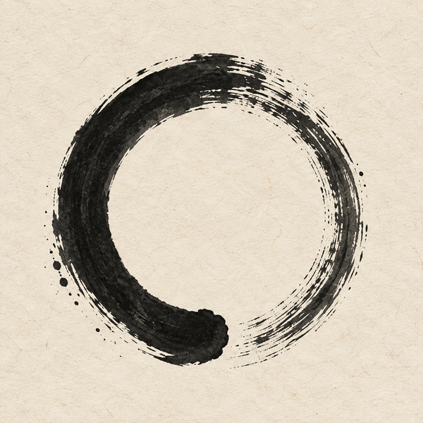
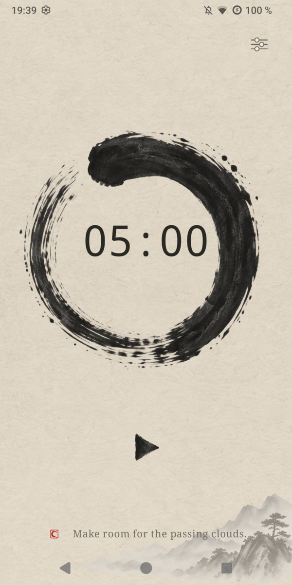

  

<h1 align="center">Enso</h1>

A quiet, offline meditation timer and interval gong for Android.

  
  
  

  

Enso is a minimal meditation timer built with Kotlin and Jetpack Compose. It runs entirely offline on Android 7.0+ (API 24), has no internet permission, accounts, analytics or ads, and is specified in [SPEC.md](docs/SPEC.md).

## What it does

- **Set any duration** from 5 minutes to 24 hours. Tap the left or right half of the ink circle to subtract or add 5 minutes; hold to repeat with gradually increasing speed. The duration is saved after every adjustment.
- **One calm screen** for Start, Pause, Resume and Stop, using hand-drawn sumi ink controls with accessible action labels.
- **Choose your gongs.** Separate Start, End and Continuous gongs, each pickable from nine bundled bell recordings and previewable in the settings sheet.
- **Rotating sayings.** Twenty original Zen-inspired lines appear on launch, at the start of each session and at every continuous interval, with a soft fade and never an immediate repeat.
- **Simple preferences.** Keep Screen Awake, Vibration and Show Saying apply immediately. The gong choice is captured when a session starts and applies to the next one.

## License

[MIT](LICENSE)
